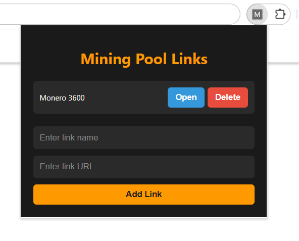

# Mining Pool Link Manager

A Chrome extension for managing and quickly accessing multiple cryptocurrency mining pool links.

## Features

- Add and store mining pool links with custom names
- Open saved links in new tabs with a single click
- Delete links you no longer need
- Modern, crypto-themed user interface

## Installation

1. Clone this repository or download the ZIP file
2. Open Chrome and navigate to `chrome://extensions/`
3. Enable "Developer mode" in the top right corner
4. Click "Load unpacked" and select the directory containing the extension files

## Usage

1. Click the extension icon in your Chrome toolbar
2. Add new links by entering a name and URL
3. Click "Open" to visit a saved link in a new tab
4. Click "Delete" to remove a link from your list

## Technologies Used

- HTML
- CSS
- JavaScript
- Chrome Extension API

## Contributing

Contributions are welcome! Please feel free to submit a Pull Request.

## License

This project is open source and available under the [MIT License](LICENSE).

## Contact

If you have any questions or suggestions, please open an issue in this repository.
